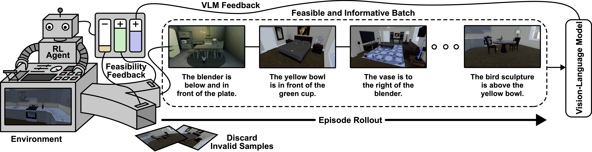

# [RLS3: RL-Based Synthetic Sample Selection to Enhance Spatial Reasoning in Vision-Language Models for Indoor Autonomous Perception (ICCPS 2025)](https://iccps.acm.org/2025/accepted-papers/index.html) 


<hr style="margin: 1px 0; border: 0; border-top: 0.0px solid #ccc;">



<hr style="margin: 1px 0; border: 0; border-top: 0.0px solid #ccc;">

## Abstract
Vision-language model (VLM) fine-tuning for application-specific visual grounding based on natural language instructions has become one of the most popular approaches for learning-enabled autonomous systems. However, such fine-tuning relies heavily on high-quality datasets to achieve successful performance in various downstream tasks. Additionally, VLMs often encounter limitations due to insufficient and imbalanced fine-tuning data. To address these issues, we propose a new generalizable framework to improve VLM fine-tuning by integrating it with a reinforcement learning (RL) agent. Our method utilizes the RL agent to manipulate objects within an indoor setting to create synthetic data for fine-tuning to address certain vulnerabilities of the VLM. Specifically, we use the performance of the VLM to provide feedback to the RL agent to generate informative data that efficiently fine-tune the VLM over the targeted task (e.g. spatial reasoning). The key contribution of this work is developing a framework where the RL agent serves as an informative data sampling tool and assists the VLM in order to enhance performance and address task-specific vulnerabilities. By targeting the data sampling process to address the weaknesses of the VLM, we can effectively train a more context-aware model. In addition, generating synthetic data allows us to have precise control over each scene and generate granular ground truth captions. Our results show that the proposed data generation approach improves the spatial reasoning performance of VLMs, which demonstrates the benefits of using RL-guided data generation in vision-language tasks.

## Keywords
spatial reasoning, synthetic data generation, self-improving sampling, vision-language models

## Citation
```
@inproceedings{waiteICCPS2025
    author={Waite, Joshua R and Hasan, Md Zahid and Liu, Qisai and Jiang, Zhanhong and Hegde, Chinmay and Sarkar, Soumik},
    title={RLS3: RL-Based Synthetic Sample Selection to Enhance Spatial Reasoning in Vision-Language Models for Indoor Autonomous Perception},
    booktitle={2025 ACM/IEEE 16th International Conference on Cyber-Physical Systems (ICCPS)}, 
    year={2025},  
    volume={},  
    number={},  
    pages={},  
    keywords={spatial reasoning; synthetic data generation; self-improving sampling; vision-language models},
    doi={10.48550/arXiv.2501.18880}
  }
```

# Website License
<a rel="license" href="http://creativecommons.org/licenses/by-sa/4.0/"></a><br />This work is licensed under a <a rel="license" href="http://creativecommons.org/licenses/by-sa/4.0/">Creative Commons Attribution-ShareAlike 4.0 International License</a>.
